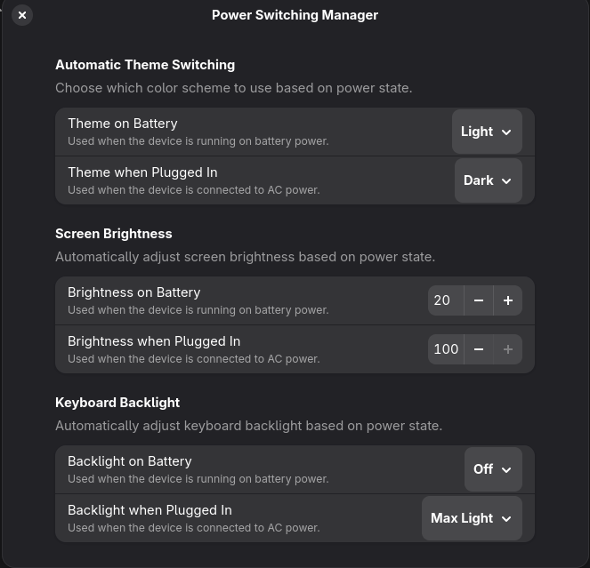

# Power Switching Manager

A GNOME Shell extension that automatically switches your theme, screen brightness, and keyboard backlight based on whether your device is running on battery power or plugged into AC power.



## Features

- **Automatic Theme Switching**: Seamlessly switch between light and dark themes depending on power state
- **Screen Brightness Control**: Automatically adjust screen brightness when switching between battery and AC power
- **Keyboard Backlight Management**: Control keyboard backlight intensity based on power state
- **Persistent Settings**: Your preferences are saved and applied whenever power state changes

## Installation

### From Source

1. Clone or download this extension to your local GNOME extensions directory:
   ```bash
   git clone https://github.com/yourusername/power-switching-manager ~/.local/share/gnome-shell/extensions/power-switching-manager
   ```

2. Compile the GSettings schema:
   ```bash
   glib-compile-schemas ~/.local/share/gnome-shell/extensions/power-switching-manager/schemas/
   ```

3. Enable the extension:
   - Using GNOME Tweaks or the Extensions app
   - Or via command line: `gnome-extensions enable power-switching-manager@joseruibarros.com`

## Compatibility

- GNOME Shell 45+

## Acknowledgments

This extension was inspired by the [Screen Brightness Governor](https://github.com/inbalboa/gnome-brightness-governor) extension by [inbalboa](https://github.com/inbalboa).

## License

This project is licensed under the GNU General Public License v2.0 or later. See the [LICENSE](LICENSE) file for details.
